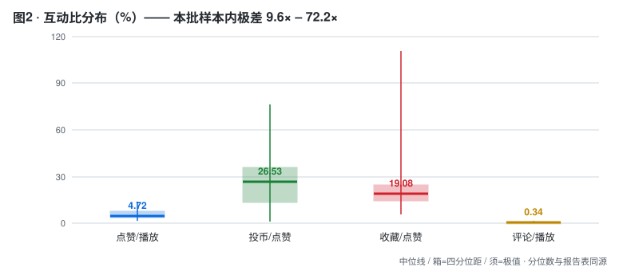
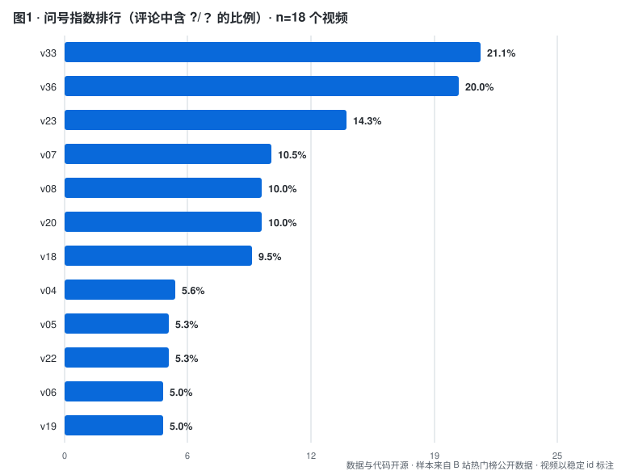

# B 站互动数据的两种形态：注水与共鸣

> 用**公开接口**（无需登录）建立互动比基线，并测量两种相反的数据形态。
> 不做判定，不点名，只回答：**这批互动数据是「真的吗」「是什么形状」。**

**日期**：2026-09-23
**样本**：热门榜 **45 个视频** → 其中 **18 个**取到评论（n=18）→ 去重后 **353 条唯一评论**
**标注方式**：视频一律用稳定 id（`v01`…`v45`），真标题不入库（对照表在 `data/raw-local/`，不进 git）
**数据与代码**：见本仓库

---

## 一句话结论

**正常视频之间的互动比差异高达 9.6× 到 72.2× —— 所以「用固定阈值判断刷量」在方法上就是错的，必须比较「相对同群分布的偏离度」。**

这不是技术细节，这是大多数刷量检测工具误报的根源。

> ⚠️ 本结论的数字来自本仓库脚本实测（n=18）。旧版这里写的是「10–100 倍」——
> 本批样本里**没有任何一对**达到 100×，最高的投币/点赞极差是 **72.2×**。
> 数字出处：`python3 analysis/analyze.py` 的「互动比中位数」段。

---

## 一、为什么把两件事合并做

「注水检测」和「问号分析」看起来是相反的两件事，其实是同一个问题的两面：

```
注水（假互动）   分布过于【规则 / 突变】
                 点赞率异常高 · 投币比异常低 · 评论高度模板化

问号（真共鸣）   分布有【结构】
                 短促 · 密集 · 情绪集中 · 语义多样
                        ↓
        统一问题：这批互动数据是【真的吗】【是什么形状】
```

**两者用同一批数据、同一套采集、同一套统计 —— 所以合并成一个工具。**

---

## 二、方法

### 数据来源（全部公开，无需登录）

| 接口 | 用途 | 实测 |
|---|---|---|
| `x/web-interface/view` | 视频 stat（播放/点赞/投币/收藏/分享/评论/弹幕） | ✅ |
| `x/web-interface/popular` | 热门榜（批量取视频） | ✅ |
| `x/v2/reply/main` | 评论（JSON，每页 20 条） | ⚠️ **只有第 1 页可用** |
| 弹幕接口 | ~~弹幕文本~~ | ❌ **不可用** |

**四个实测出来的细节（对后来者有用）：**

```
① x/v2/reply     只返回 3 条      → 换 x/v2/reply/main 才给满 20 条
② pn 参数无效    实测 pn=1/2/3 返回同一批 rpid（314719551921 / 318314835872）
                 → 评论分页不可用；旧版本因此把同一页抄了多遍（1086 行里大半是复制）
③ 接口返回码被旧版丢掉 → 旧版「约 60–80 次请求后限流」这句结论**没有日志支撑**，
                 本版改为照实说：27 个视频的评论接口返回 0 条，原因当时未记录
④ 弹幕需要登录 + 签名：新端点返回的是配置信息不是弹幕列表；
   旧 XML 端点解压后只剩 <i> 头部，无 <d> 元素
```

### 样本

```
热门榜 3 页 → 45 个视频
其中 18 个取到评论（去重后每视频 18–21 条唯一评论，中位 20 条）
其余 27 个的评论接口返回 0 条 —— 原因未记录（旧版采集器把返回码丢了）

原始写入 1086 行 → 按 (aid, 评论文本) 去重后 353 条
去重后统计用的 n = 18（不是 45）
```

### 指标计算

```
互动比     点赞/播放 · 投币/点赞 · 收藏/点赞 · 评论/播放
评论文本   完全重复率 · 前 8 字重复率 · 平均等级   ← 都在【去重后】的文本上算
问号指数   含 ?/？ 的评论占比 · 含 ???/？？？ 的占比 · 每千字问号数
偏离度     有符号稳健 z = (x − median) / (1.4826 × MAD)，阈值 |z| ≥ 3
```

**为什么用 MAD 而不是标准差**：稳健。少数极端值不会污染阈值。

**为什么要保留 z 的符号**：方向性判据必须用单侧。旧版 z 取了绝对值，
于是「投币比偏低」写成 `z >= 3.0` —— 方向反了，该条件**永远不可能成立**。

---

## 三、发现一：互动比基线（核心产出）



| 指标 | 中位 | 区间（n=18 的最小–最大） | 极差倍数 |
|---|---|---|---|
| 点赞 / 播放 | **4.72%** | 1.46% – 14.03% | **9.6×** |
| 投币 / 点赞 | **26.53%** | 1.06% – 76.35% | **72.2×** |
| 收藏 / 点赞 | **19.08%** | 5.42% – 110.85% | **20.4×** |
| 评论 / 播放 | **0.34%** | 0.12% – 1.43% | **11.8×** |

> 生成命令：`python3 analysis/analyze.py`（打印的「── 互动比中位数 ──」段与上表同源）。
> 表里的中位数与图2 里的中位数由同一个 `percentile()` 函数算出，`make_figures.py` 结尾会断言一致。

### 这张表最重要的不是中位数，是【极差】

```
投币率的正常区间是 1.06% – 76.35% —— 相差 72.2 倍
收藏率的正常区间是 5.42% – 110.85% —— 收藏数能超过点赞数（正常现象：教程类内容）
```

**结论：**

```
❌ 错的做法：设一个阈值（比如"点赞率 > 10% 就是刷的"）
             → 会误伤真实内容（本样本里有 1 个视频点赞率达 14.03%）
✅ 对的做法：与【同时长、同类型】的分布比，看偏离度
             （本批 45 行里 tname 分区字段**全为空串**，所以"同分区比较"目前做不到，见「局限」）
```

**这也解释了为什么很多"刷量检测"服务给出的结论经不起反驳 —— 它们的阈值没有分布基础。**

---

## 四、发现二：问号指数 —— 本批数据里「锐评」类最高



| # | 问号指数 | 视频 | 唯一评论数 |
|---|---|---|---|
| 1 | **21.1%** | `v33`（锐评类） | 19 |
| 2 | **20.0%** | `v36`（锐评类） | 20 |
| 3 | 14.3% | `v23` | 21 |
| 4 | 10.5% | `v07`（剧情解说类） | 19 |
| 5 | 10.0% | `v08`（猎奇/生活类） | 20 |
| 6 | 10.0% | `v20` | 20 |

### 这个排序不违反直觉，但**不足以支撑因果结论**

**问号是「预期违背」的潜在标记** —— 观众被内容震到、看不懂、或发现反转时可能会打出来。

从 id 看（对照表在 `data/raw-local/video_id_map.csv`），排在前的两条都是锐评类内容。
但这只是 **n=18、每视频约 20 条评论**的观察，**分不出"内容形态导致问号"还是"这两条视频恰好如此"**。
要检验这个假设，需要每视频几百条评论 + 多个视频，那是本项目目前做不到的。

### ⚠️ 三重问号率在本批数据里恒为 0

353 条唯一评论里**没有任何一条**含 3 个以上连续问号（`analysis.json` 中所有 `q3_rate = 0`）。
所以：

- 图3（`fig3_q3.svg`）已删除 —— 一张全是 0 的图支撑不了任何论断
- 上表「含？？？的比例」列在本批数据里没有信息量，已从表里去掉
- 旧版用图3 支撑「？？？同时触发弹幕+评论+完播+二刷」的说法 —— **那段论述已删**：
  该说法若成立需要弹幕数据，而弹幕接口本批不可用

---

## 五、发现三：偏离检测的正确用法

在本批 18 个视频中，**1 个**触发了至少一项偏离标记：

| 视频 | 触发项 | 实测值 |
|---|---|---|
| `v21` | 点赞率异常高 | z = +4.90，点赞率 14.03% |

**每个标记在本批数据里能否为真（旧版没有这一栏，只写「0 个触发」，读起来像「数据正常」）：**

| 标记 | 方向 | 本批极端 z | 本批可达 |
|---|---|---|---|
| 点赞率异常高 | 高尾 | +4.90 | ✅ 是 |
| 投币比异常低 | 低尾 | −1.45 | ❌ 否（够不到 −3） |
| 前 8 字重复率异常高 | 高尾 | +0.00 | ❌ 否（MAD = 0，全样本该指标无离散度） |

**这条必须展开说清楚：**

```
① 「投币比偏低」这个判据，本批数据里根本触发不了 —— 极端值只有 z = −1.45。
   旧版把它写成 z >= +3（绝对值 + 方向反），更是永远不可能成立。
② 「评论模板化」这个判据，去重后连离散度都没有了：
   353 条唯一评论文本的「前 8 字重复率」中位数是 0，最大值只有 5.3%，
   MAD = 0 → z 恒为 0。旧版能报出 3 个"模板化"视频，
   是因为它把同一页评论抄了 3 遍，重复率当然高 —— 那测的是采集器的 bug。
```

**这正是这个项目最想说明的一点：**

```
文本重复度 → 无法区分「跟风刷梗」与「水军灌入」
互动比异常 → 无法区分「真实爆款」与「刷量买赞」

所以任何单一指标都不足以判定，任何"AI 一键检测刷量"都值得怀疑。
```

**能做的是：给出指标与偏离度，把判断留给有上下文的人。**

---

## 六、本项目不做获取侧

**本项目只做「检测侧」，不做「获取侧」**：不提供任何刷量、水军、数据优化的方法或渠道，
也不回答「怎么刷」「去哪里买」这类问题。

**不接受单账号委托，不出具单视频报告。**
单视频没有分布，就没有基线可依据；拿一个视频的 z 分数下结论，等于用噪声下结论。
如果你手上有一个视频，本项目能做的只是把它的指标放进基线里看位置 —— 那是分析，不是鉴定。

---

## 七、局限（必须先读这一段）

| 局限 | 说明 |
|---|---|
| **n = 18，不是 45** | 45 个视频里 27 个的评论接口返回 0 条。旧版采集器把接口返回码丢了，**当时为什么返回 0 条已不可考**（本版已补 `fetch_log.jsonl`）。所有评论类指标 n = 18 |
| **样本来自热门榜** | 热门榜是平台推荐位，**刷量视频通常上不了热榜** → 本批样本本来就抓不到注水。本项目建立的是**正常基线**，不是抓取案例 |
| **评论只有第 1 页** | `pn` 参数无效（pn=1/2/3 同一批 rpid），每视频最多 20 条唯一评论 → 比例类指标置信区间很宽，问号指数的 1 个百分点≈0.2 条评论 |
| **`q3_rate` 恒为 0** | 本批 353 条唯一评论无一条含 3 个以上连续问号，该指标无信息量，图3 已删 |
| **`tname` 分区字段为空** | 45 行的 `tname` 全是空串 → **"和同分区比"目前做不到**；旧版的分区分布表是空表，已删 |
| **弹幕数据缺失** | 弹幕接口需登录 + 签名，本轮不可用。弹幕本应是「问号」的最佳数据源（弹幕比评论短促、密度高） |
| **文本重复度无法区分性质** | 跟风刷梗与水军灌入在文本特征上相同；且本批去重后重复度几乎全为 0，这个指标在本批数据上基本没被检验到 |
| **单一时间点** | 没有时间序列 → 无法做"增长曲线突变"检测（那需要连续采集） |
| **不做判定** | 全篇只报告指标与偏离度，**不对任何视频或账号做定性** |

---

## 八、复现

```
bili/api.py               公开接口客户端（含手写 protobuf 解析，本轮未用上）
bili/collect.py           采集器（限速 0.6–1.3s/请求；原始数据只写 data/raw-local/）
analysis/anonymize.py     拆分「本机留档」与「可发布」+ 自检无泄漏
analysis/pipeline.py      去重 / 分位数 / 有符号稳健 z（analyze 与 make_figures 共用）
analysis/analyze.py       互动比 + 问号指数 + 偏离度 → analysis.json + 数据观察.md
analysis/make_figures.py  SVG 图表（零依赖）
analysis/verify.py        一键自检 29 项（重跑 + 数字自洽 + 隐私无泄漏）
data/videos.jsonl         45 个视频的 stat（匿名，owner_ref: u01…）
data/comments.jsonl       18 行逐视频派生指标（无评论文本、无 uid）
data/analysis.json        逐视频指标（键 v01…）
report/figures/*.svg      2 张图
```

```bash
python3 bili/collect.py --pages 3 --comment-pages 1   # 采集（原始数据进 raw-local）
python3 analysis/anonymize.py                          # 匿名化 + 自检
python3 analysis/analyze.py                            # 分析
python3 analysis/make_figures.py                       # 图
python3 analysis/verify.py                             # 自检（29 项，失败返回码 1）
```

**⚠️ 采集时注意限流**：本批 45 个视频里有 27 个的评论接口返回 0 条。
原因**没有日志可查**（旧版把返回码丢了）—— 本版每次请求都写 `data/raw-local/fetch_log.jsonl`（含 `code`），
下次采集就能判断到底是限流、还是接口对某些视频返回 0。建议间隔 ≥2 秒，或分批多次采集。

---

## 九、立场

```
· 只用公开接口，不登录、不抓需要授权的数据
· 不做任何刷量操作，也不提供获取虚假互动的方法
· 不点名指控任何账号或 UP 主 —— 发布版不含真标题与 UP 名，视频以 v01… 标注
· 不保存可反查的用户身份：发布版不含 uid，也不含 sha1(mid) 这类可反查哈希
· 不接受单账号委托，不出具单视频报告
· 限速请求，不给平台造成负担
· 最想说明的一点：【偏离 ≠ 注水】，任何单一指标都不足以判定
```
