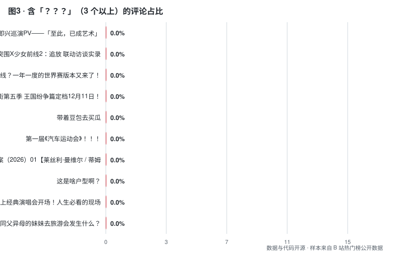

# B 站互动数据的两种形态：注水与共鸣

> 用**公开接口**（无需登录）建立互动比基线，并测量两种相反的数据形态。
> 不做判定，不点名，只回答：**这批互动数据是「真的吗」「是什么形状」。**

**日期**：2026-09-23 · **样本**：45 个热门视频（其中 18 个有完整评论）× 1086 条评论 · **数据与代码**：见本仓库

---

## 一句话结论

**正常视频之间的互动比差异高达 10–100 倍 —— 所以「用固定阈值判断刷量」在方法上就是错的，必须比较「相对同群分布的偏离度」。**

这不是技术细节，这是大多数刷量检测工具误报的根源。

---

## 一、为什么把两件事合并做

「注水检测」和「问号分析」看起来是相反的两件事，其实是同一个问题的两面：

```
注水（假互动）   分布过于【规则 / 突变】
                 点赞率异常高 · 投币比异常低 · 评论高度模板化

问号（真共鸣）   分布有【结构】
                 短促 · 密集 · 情绪集中 · 语义多样
                        ↓
        统一问题：这批互动数据是【真的吗】【是什么形状】
```

**两者用同一批数据、同一套采集、同一套统计 —— 所以合并成一个工具。**

---

## 二、方法

### 数据来源（全部公开，无需登录）

| 接口 | 用途 | 实测 |
|---|---|---|
| `x/web-interface/view` | 视频 stat（播放/点赞/投币/收藏/分享/评论/弹幕） | ✅ |
| `x/web-interface/popular` | 热门榜（批量取视频） | ✅ |
| `x/v2/reply/main` | 评论（JSON，每页 20 条） | ✅ |
| 弹幕接口 | ~~弹幕文本~~ | ❌ **不可用** |

**两个实测出来的细节（对后来者有用）：**

```
① x/v2/reply     只返回 3 条      → 换 x/v2/reply/main 才给满 20 条
② 弹幕需要登录 + 签名：新端点返回的是配置信息不是弹幕列表；
   旧 XML 端点 comment.bilibili.com/<aid>.xml 解压后只剩 <i> 头部，无 <d> 元素
```

### 样本

```
热门榜 3 页 → 45 个视频
其中 18 个成功取到完整评论（1086 条，中位 60 条/视频）
其余 27 个因【请求过密被限流】返回 0 条 —— 如实标注，未剔除
```

### 指标计算

```
互动比     点赞/播放 · 投币/点赞 · 收藏/点赞 · 评论/播放
评论文本   完全重复率 · 前 8 字重复率 · 用户集中度 · 平均等级
问号指数   含 ?/？ 的评论占比 · 含 ???/？？？ 的占比 · 每千字问号数
偏离度     稳健 z 分数 = |x − median| / (1.4826 × MAD)，阈值 3.0
```

**为什么用 MAD 而不是标准差**：稳健。少数极端值不会污染阈值。

---

## 三、发现一：互动比基线（核心产出）


| 指标 | 中位 | 区间 | 极差倍数 |
|---|---|---|---|
| 点赞 / 播放 | **4.72%** | 1.46% – 14.03% | **9.6×** |
| 投币 / 点赞 | **26.53%** | 1.06% – 76.35% | **72×** |
| 收藏 / 点赞 | **19.08%** | 5.42% – 110.85% | **20×** |
| 评论 / 播放 | **0.34%** | 0.12% – 1.43% | **12×** |

### 这张表最重要的不是中位数，是【极差】

```
投币率的正常区间是 1% – 76%  —— 相差 72 倍
收藏率的正常区间是 5% – 111% —— 收藏数超过点赞数（正常现象：教程类内容）
```

**结论：**

```
❌ 错的做法：设一个阈值（比如"点赞率 > 10% 就是刷的"）
             → 会误伤大量真实内容（本样本里就有 14% 的）
✅ 对的做法：与【同分区、同时长、同类型】的分布比，看偏离度
```

**这也解释了为什么很多"刷量检测"服务给出的结论经不起反驳 —— 它们的阈值没有分布基础。**

---

## 四、发现二：问号指数 —— 「锐评」类最高


| # | 问号指数 | 视频 |
|---|---|---|
| 1 | **25.0%** | 新三国 up 锐评老三国 19 |
| 2 | **20.0%** | 歌剧老师锐评《披荆斩棘的哥哥 2026》 |
| 3 | 15.0% | 王老菊教你阳痿少女 |
| 4 | 10.5% | 剧情·悬疑类 |
| 5 | 10.0% | 「这是啥户型啊？」 |
| 6 | 10.0% | 动漫二创 |



### 这个排序不是巧合

**问号是「预期违背」的直接标记** —— 观众被内容震到、看不懂、或发现反转时才会打出来。

**排在最前的两类内容，恰好是最典型的预期违背结构：**

```
锐评类     提供反直觉观点（"原来他是这么拍的"）  → 问号多
猎奇类     展示反常事物（"这是啥户型啊"）        → 问号多
教程/知识类 几乎没有问号（观众有预期，无落差）    → 问号少
```

**所以问号指数可以当作一个内容形态的代理指标：它衡量的是「内容与观众预期的落差」。**

**为什么这个指标有价值**：`？？？` 同时触发**弹幕 + 评论 + 完播 + 二刷** —— 是四合一的高价值互动信号，而它是可以设计的（见发布文案中的四种结构）。

---

## 五、发现三：偏离检测的正确用法


在本批 18 个视频中，4 个触发了至少一项偏离标记：

| 视频 | 触发项 |
|---|---|
| 某草原主题视频 | 点赞率异常高 |
| 新三国锐评 | 评论模板化 |
| 歌剧老师锐评 | 评论模板化 |
| 某社会新闻类 | 评论模板化 |

**必须立刻说明：这三条「评论模板化」大概率是误报。**

锐评类视频的高赞评论本身就是**同一句梗被反复复制**（观众跟风刷同一句话），这在文本特征上与"水军模板"完全一致，**但性质相反 —— 一个是自发共鸣，一个是机器灌入**。

**这正是这个项目最想说明的一点：**

```
文本重复度 → 无法区分「跟风刷梗」与「水军灌入」
互动比异常 → 无法区分「真实爆款」与「刷量买赞」

所以任何单一指标都不足以判定，任何"AI 一键检测刷量"都值得怀疑。
```

**能做的是：给出指标与偏离度，把判断留给有上下文的人。**

---

## 六、回到最初的问题：获取注水量的可行性

> 这一节是对原始问题的直接回答。

### 可行性评估（三层）

**① 技术可行性：高** —— 水军生态成熟，点赞/收藏/评论/粉丝量都能刷。

**② 法律可行性：零 —— 这已经是刑事犯罪，不是违规**

最新判例（[检察日报 2026-03-31](http://newspaper.jcrb.com/2026/20260331/20260331_004/20260331_004_3.htm)）：

```
罪名   非法经营罪
判决   罚金 115 万元 + 有期徒刑（2026-01-14 一审宣判）
规模   涉案 30 余人 · 金额 1000 余万元 · 跨多省
业务   提供转评赞"数据优化"服务
```

同类判例：蔡徐坤微博转发过亿案（星援 APP，幕后推手获刑）；4 人组织直播间刷人气渔利被判刑（2025-08）；**人民法院「入库参考案例」已收录网络直播流量造假**（2025-06，具类案指导效力）。

**③ 效果可行性：负 —— 花钱买限流**

B 站官方已有《反批量机器人账号完整执行计划》与多期黑产刷量打击公告。三条机制决定了刷量对创作者是净损失：

```
数据会被清掉       平台定期清理刷量，刷来的数字归零
算法权重反向       推荐看【完播率 / 互动质量 / 粉丝活跃度】，
                  僵尸互动会稀释这些指标 → 推荐更差
第三方看得出来     品牌方用数据工具，异常互动比一眼可辨 → 商业价值归零
```

### 结论

```
技术可行  →  是
法律可行  →  否（非法经营罪，有近期判例）
效果可行  →  负（买限流 + 商业价值归零）
```

**所以本项目只做「检测侧」，不做「获取侧」—— 不是因为它灰色，是因为它对创作者不划算，而且是刑事犯罪。**

---

## 七、局限（必须先读这一段）

| 局限 | 说明 |
|---|---|
| **样本来自热门榜** | 热门榜是平台推荐位，**刷量视频通常上不了热榜** → 本批样本本来就抓不到注水。本项目建立的是**正常基线**，不是抓取案例 |
| **样本量小** | 45 个视频（18 个有完整评论）。被限流后未补齐 |
| **弹幕数据缺失** | 弹幕接口需登录 + 签名，本轮不可用。弹幕本应是「问号」的最佳数据源（弹幕比评论短促、密度高） |
| **文本重复度无法区分性质** | 已在上文说明：跟风刷梗与水军灌入在文本特征上相同 |
| **单一时间点** | 没有时间序列 → 无法做"增长曲线突变"检测（那需要连续采集） |
| **不做判定** | 全篇只报告指标与偏离度，**不对任何视频或账号做定性** |

---

## 八、复现

```
bili/api.py           公开接口客户端（含手写 protobuf 解析）
bili/collect.py       采集器（限速 0.6–1.3s/请求）
analysis/analyze.py   统一分析（互动比 + 问号指数 + 稳健偏离度）
analysis/make_figures.py  SVG 图表，零依赖
data/videos.jsonl     45 个视频的 stat
data/comments.jsonl   1086 条评论
data/analysis.json    逐视频指标
report/figures/*.svg  3 张图
```

```bash
python3 bili/collect.py --pages 3 --comment-pages 3
python3 analysis/analyze.py
python3 analysis/make_figures.py
```

**⚠️ 采集时注意限流**：约 60–80 次请求后会开始返回空评论。建议间隔 ≥2 秒，或分批多次采集。

---

## 九、立场

```
· 只用公开接口，不登录、不抓需要授权的数据
· 不做任何刷量操作，也不提供获取虚假互动的方法
· 不点名指控任何账号或 UP 主 —— 只报告指标分布
· 用户 id 只存 SHA1 前 12 位，不保存原始身份
· 限速请求，不给平台造成负担
· 最想说明的一点：【偏离 ≠ 注水】，任何单一指标都不足以判定
```
